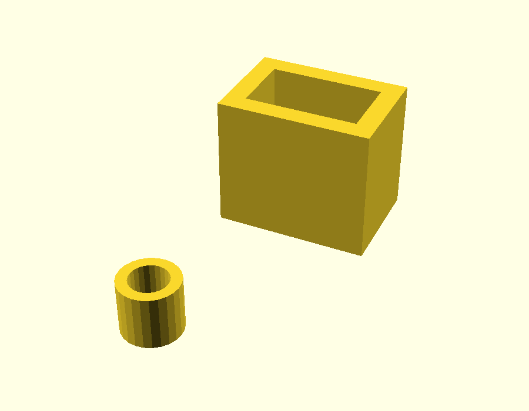
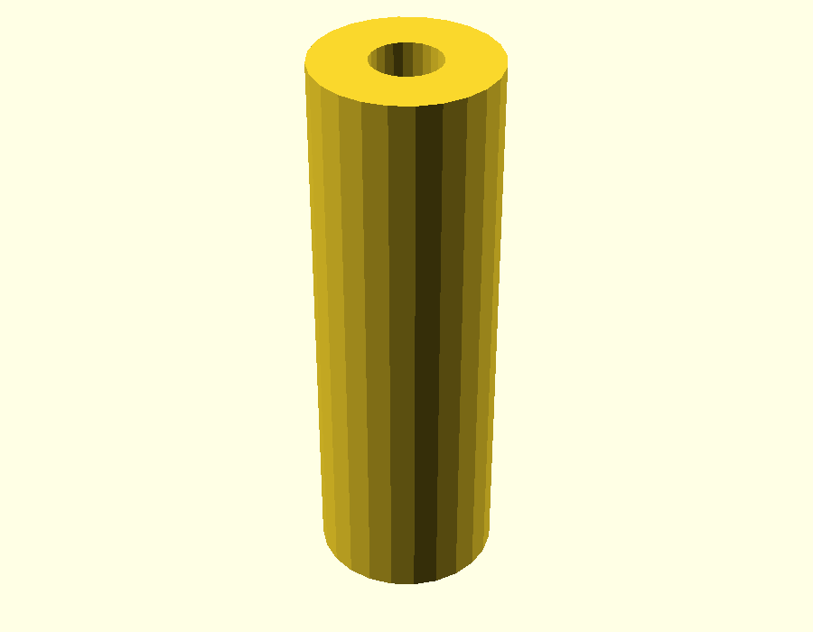

# Cable holders

Drawn by Cobus in SketchUp during the upgrade. Added 2026-10-08 from `Cable holders.stl`.

|  |  |
|---|---|
| `cable-holders.stl` | `receiver-antenna-tube.stl` |

## What it's for

Glued to the inside of the hull to keep the **signal cables and the power cables apart**. The cables run through the inside of these parts.

The **receiver antenna tube** holds the receiver's antenna wire at **90 degrees** for the best signal. It was drawn on the [GPS antenna spacer](../gps-antenna-spacer/) plate and moved here on 2026-10-09 as its own file.

Described by Cobus, 2026-10-09. **Printed in eSUN PLA+ and in use.**

## What's in the file

In millimetres:

| File | Part | Size (mm) |
|---|---|---|
| `cable-holders.stl` | Round spacer, with a hole through it | 8.9 × 8.9 × 8.0 |
| `cable-holders.stl` | Open-topped rectangular box | 23.0 × 16.0 × 20.0 |
| `receiver-antenna-tube.stl` | Tube, 2.5 mm bore (measured from the mesh) | 6.5 × 6.5 × 20.0 |

Both meshes are watertight (no open edges). The tube's triangles were copied unchanged from the GPS spacer plate.

## Source

The SketchUp `.skp` file isn't in the repo yet. Add it here as `cable-holders.skp` so the original can be reopened and changed.

## Changing it

Without the `.skp`, changes are made on this STL in OpenSCAD: adding or cutting features, or scaling. Redrawing it as a parametric `.scad` is the better route if it will keep changing.
