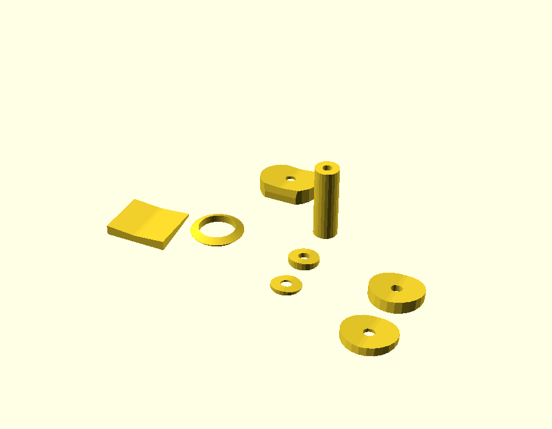

# GPS antenna spacer

Drawn by Cobus in SketchUp during the upgrade. Added 2026-10-08 from `GPS antenna spacer.stl`.

## Status

**What it's for, and whether it's printed and fitted: not yet recorded.**

## What's in the file

`gps-antenna-spacer.stl` is a print plate with 8 parts, in millimetres:

| Part | Size (mm) |
|---|---|
| Tube | 6.5 × 6.5 × 20.0 |
| Curved square pad | 17.0 × 14.0 × 2.7 |
| Ring | 14.4 × 14.4 × 2.1 |
| Shaped washers with a hole (4) | about 14-17 × 14 × 2.2-4.4 |
| Small washers (2) | 8.0 × 8.0 × 1.2 and 2.2 |

Watertight mesh (no open edges).

## Source

The SketchUp `.skp` file isn't in the repo yet. Add it here as `gps-antenna-spacer.skp` so the original can be reopened and changed.

## Changing it

Without the `.skp`, changes are made on this STL in OpenSCAD: adding or cutting features, or scaling. Redrawing it as a parametric `.scad` is the better route if it will keep changing.
