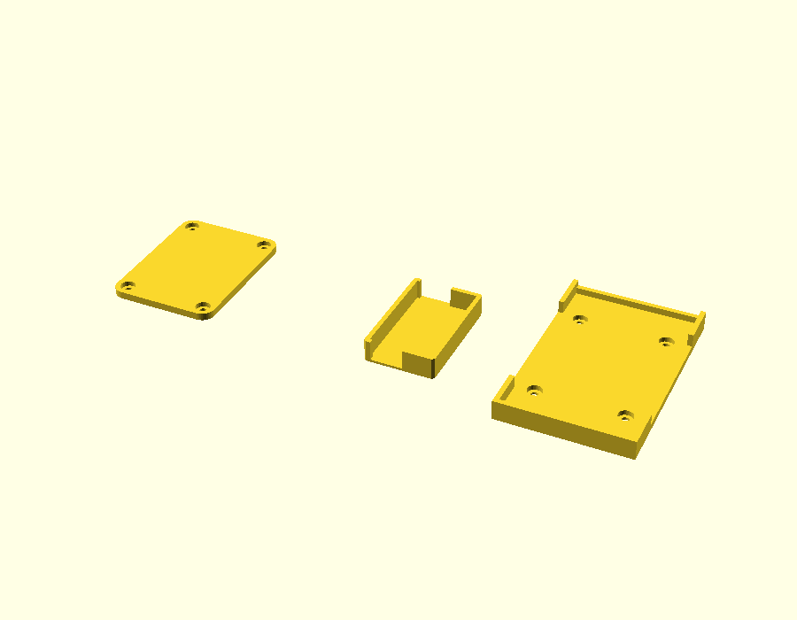

# Pixhawk bed

Drawn by Cobus in SketchUp during the upgrade. Added 2026-10-08 from `Pixhawk 4 bed.stl`.

## Status

**What it's for, and whether it's printed and fitted: not yet recorded.**

## What's in the file

`pixhawk-bed.stl` is a print plate with 3 parts, in millimetres:

| Part | Size (mm) |
|---|---|
| Flat plate, 4 corner holes | 44.5 × 59.0 × 3.0 |
| Small open tray | 29.0 × 46.8 × 9.0 |
| Large tray with side rails and 4 holes | 53.6 × 85.5 × 8.0 |

🚨 The mesh has **12 open or doubled edges**; most slicers repair this on import.

🚨 As laid out, the plate is **220.05 mm** wide, just over the K1C's 220 mm bed. Move the parts closer together in the slicer.

The file is called "Pixhawk 4 bed" but the boat runs a Pixhawk 2.4.8. The large tray (53.6 × 85.5 mm) would fit a 2.4.8, which is about 50 × 81.5 mm.

## Source

The SketchUp `.skp` file isn't in the repo yet. Add it here as `pixhawk-bed.skp` so the original can be reopened and changed.

## Changing it

Without the `.skp`, changes are made on this STL in OpenSCAD: adding or cutting features, or scaling. Redrawing it as a parametric `.scad` is the better route if it will keep changing.
