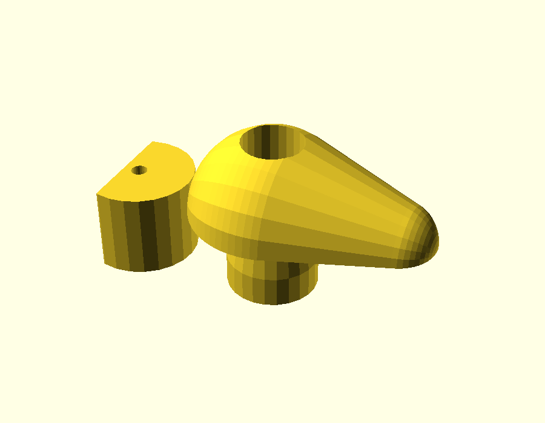

# Servo parts

Drawn by Cobus in SketchUp during the upgrade. Added 2026-10-08 from `Servo Parts.stl`.

## What it's for

**Servo horn that opens and locks the bait hoppers.** The stock hopper servos were continuous-rotation; they were replaced with normal (positional) **metal-geared servos**, and the stock horn didn't fit the new servos' spline.

Described by Cobus, 2026-10-09. **Printed in eSUN PLA+ and in use.**

## What's in the file

`servo-parts.stl` is a print plate with 2 parts, in millimetres:

| Part | Size (mm) |
|---|---|
| Half-round block with a small hole | 7.1 × 11.0 × 8.4 |
| Teardrop arm with a round boss underneath and a bore through it | 24.0 × 16.0 × 15.4 |

🚨 The mesh has **54 open or doubled edges**, which is common in SketchUp exports. Most slicers repair this on import; if a layer prints oddly, this is the first suspect.

## Source

The SketchUp `.skp` file isn't in the repo yet. Add it here as `servo-parts.skp` so the original can be reopened and changed.

## Changing it

Without the `.skp`, changes are made on this STL in OpenSCAD: adding or cutting features, or scaling. Redrawing it as a parametric `.scad` is the better route if it will keep changing.
