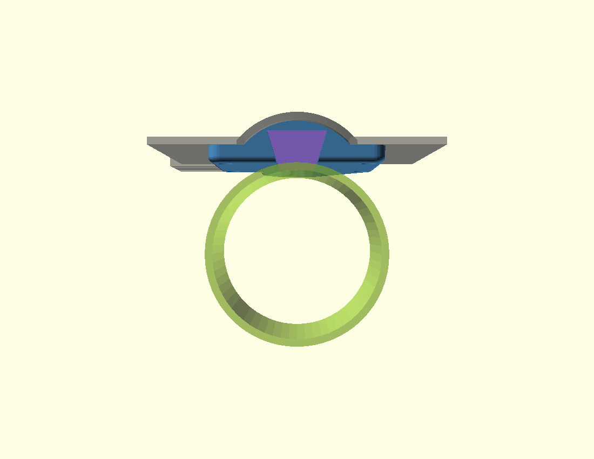
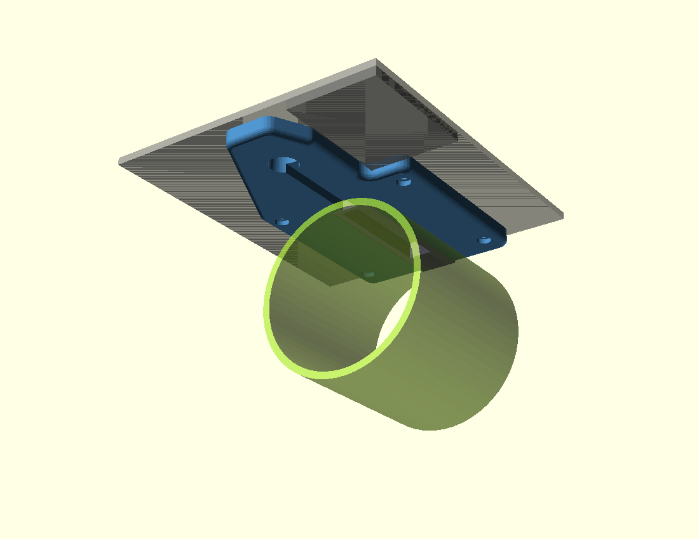
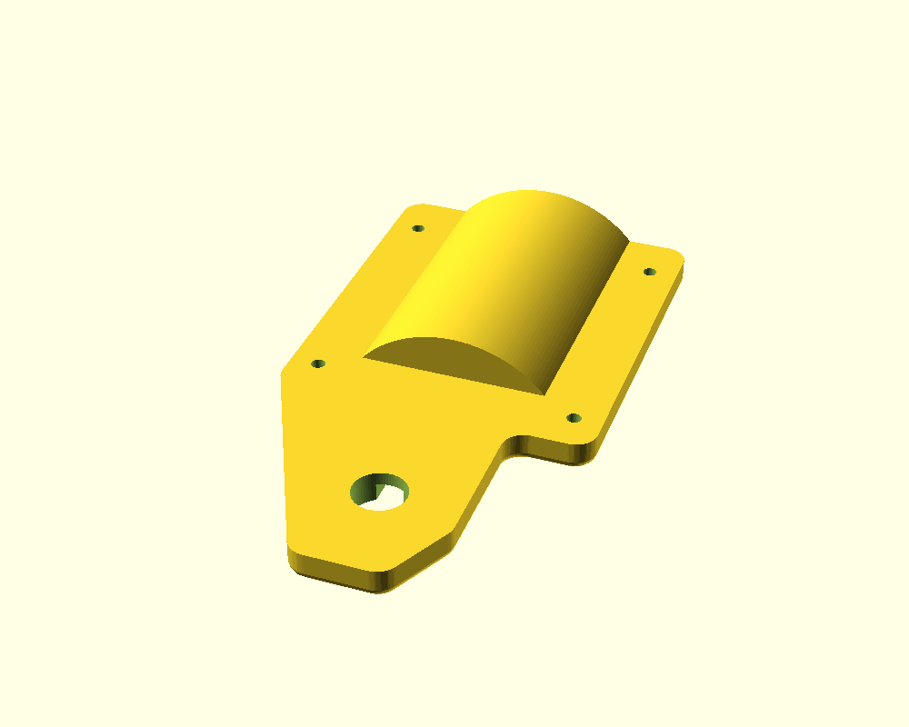
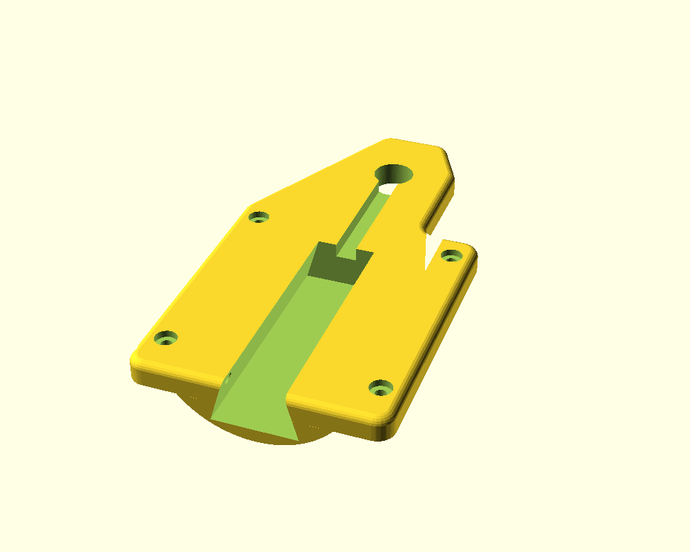
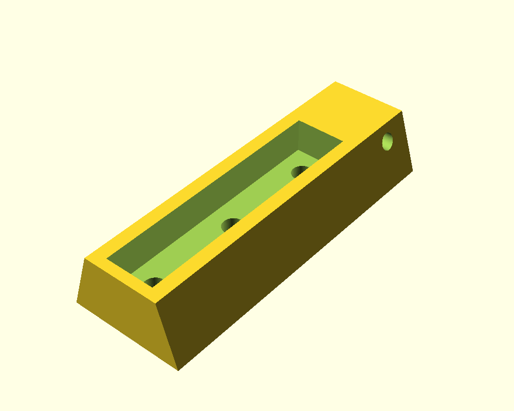
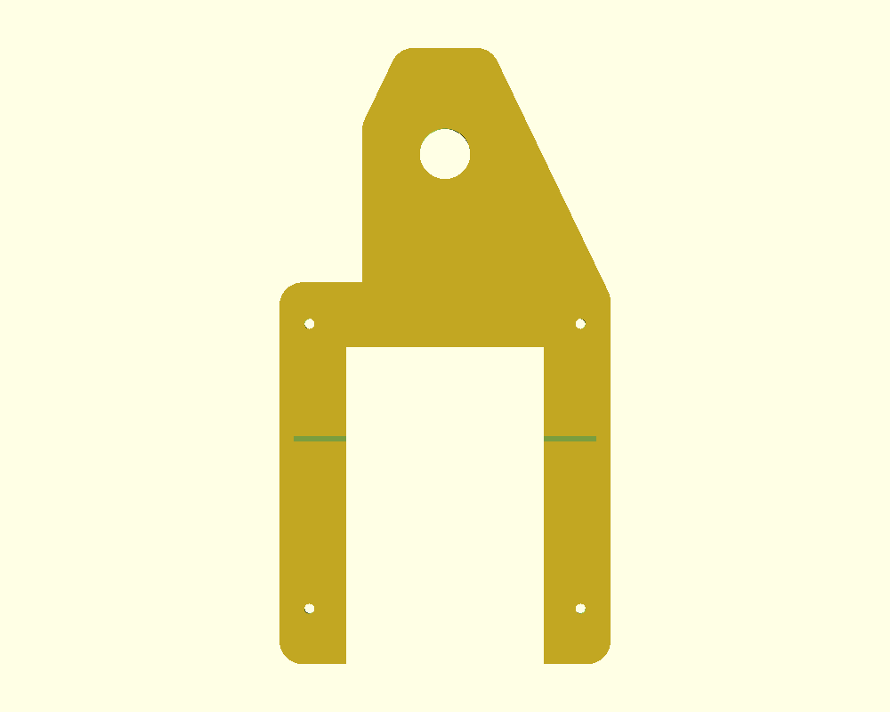

# Thruster mount

## ⭐ Version 2 (current): base + sliding carrier, on the hull's own screw posts

Designed 2026-10-09 from Cobus's measurements ([measure/](measure/)). **Not yet printed.**

| From the stern | From below |
|---|---|
|  |  |
|  |  |
| **Base**, as it prints: the hump fills the tunnel; corners and bottom edge rounded | **Base underside**: dovetail slot open at the stern, 4 post-screw pockets, wire channel to the wire hole |
|  |  |
| **Carrier**, as it prints: the foot pocket, 3 M4 holes, lock-screw hole | **Template**: a 1.2 mm plate to check the 4 holes against the hull |

Each motor position has a moulded tunnel in the hull bottom (43 wide, 10 deep, 69 long) and **4 solid posts** inside that the stock motor shield screwed into from outside. The posts are closed, so the hull is already sealed there.

- **Base (blue):** fills the tunnel and screws to the 4 posts from outside, **7 mm** below the hull. Its outline corners (5 mm) and bottom edge (2.5 mm) are rounded; the top edge stays square to bed flat on the hull. The rounded stern end also gives the dovetail slot a lead-in. That gap gives water to the duct's intake. It carries on forward as a cover over the motor wires, past the wire hole to **23 mm** beyond its centre, so it also covers the hull's old mounting hole (Cobus, 2026-10-10).
- **Carrier (purple):** a dovetail bar. The thruster's foot sinks 7 mm into it and is held by 3 M4 screws from above. It slides into the base from the stern, and forward thrust pushes it against the stop at the front.
- **Lock screw:** one M3 from the **outboard** side, so reverse thrust (the boat turns by reversing one motor) can't pull the carrier out. That's why there's a left and a right version.
- **Step relief:** the strips are shallow pockets. On the **inboard** side, at 84 mm from the transom, the hull stands 4 mm proud (the template's corner caught on it, 2026-10-10). The base is **cut away** over that area (Cobus, 2026-10-10): first designed as a 4.5 mm relief, but a cover there only trapped water and added drag, and it carries no load (the nearest post screws are 10 mm aft). The cut-out's edges get the same 2.5 mm round as the rest. Where the base meets the raised area there is still a 3 mm lip, because the base's underside is 7 mm below the strip and the raised hull only 4. The outboard strip runs to the hull edge and has no step.
- **Which is which:** on each version the lock screw and the step cut-out are on opposite sides. Fit it with the **lock screw towards the hull's outer edge**; the cut-out then clears the step.

**Why two parts:** the duct's oval openings are closed, so the foot screws can only go in from above. The duct also covers the post screws. One single part could never be assembled.

**Considered and rejected, 2026-10-10: a one-piece mount.** It would be simpler to print, with no dovetail and no lock screw. But the motor would have to be bolted on first, and then the duct sits right over the 4 hull screws: the aft pair are 12 mm inside the duct's footprint, with only 15-22 mm of room below them. So they couldn't be driven from outside. It would only work with the screws driven from **inside** the hull, down through the 4 posts drilled right through. Cobus chose to keep v2: the hull stays sealed, and a motor slides out from the stern without opening the hull.

### Fitting it

0. **Remove the moulding ridge first.** A raised line about 1 mm high runs round the whole mount area: along the strips and round the wire-hole recess ([Cobus's blue line](photos/20261010_ridge_marked_cobus.jpg), 2026-10-10). The base sits on it, which is what lifted the dovetail test piece. Shave it flush with a chisel held bevel-up and flat, or a scraper, then a sanding block (~240). Never go below the surface; the hull is about 3 mm. Check with a straight edge. The sanding also gives the epoxy a key.
1. **Pilot holes:** open the hull's 2 mm holes to **2.4 mm**, about **12 mm deep** from outside. Tape round the drill bit marks the depth. Hull and post together are 17.5 mm, so this leaves the post's closed top intact. Do one post first and check it doesn't crack.
2. **Base:** screw it to the 4 posts with **ST2.9 × 13**, with the thruster off. A dab of marine sealant on each screw stops water wicking into the posts. Epoxy bedding is **optional** (decided 2026-10-10): at about 6 N per screw at full thrust, the screws carry the load. Bedding would only help spread knocks.
3. **Foot holes:** drill the thruster foot's 3 mm holes out to **3.3 mm** and tap them **M4**, to their existing depth only. **Never drill through.** The foot sits on the duct, and a bolt end would hit the propeller.
4. **Carrier:** bolt the foot into it on the bench, with 3 × **M4 countersunk**. Drop the M3 nut into its slot in the carrier's top.
5. **Assemble:** slide the carrier in from the stern until it stops, then fit the **M3 × 40** lock screw from the outboard side.
6. **Wires:** run them along the channel and up through the wire hole. Seal the hole with a cable gland or potting.

### Parts for both sides

| Qty | Part | For |
|---|---|---|
| 8 (+ spares) | **ST2.9 × 13** stainless pan-head self-tapper | Base to the 4 posts, each side |
| 6 | **M4 countersunk** stainless, about **× 12**. Length to check: 6.1 mm goes through the carrier, the rest into the foot | Foot to carrier |
| 2 | **M3 × 40** stainless machine screw + **2 M3 nuts** | Lock screws |
| 1 each | 2.4 mm and 3.3 mm drill, **M4 tap** | Pilot holes and foot holes |
| 1 | Marine sealant (e.g. Sikaflex); thickened epoxy only if you choose to bed the bases | Screws, and optional bedding |
| 2 | Cable gland, or sealant to pot the wire holes | Wire holes |
| — | ABS (or ASA) filament | Bases and carriers |

The v1 shopping list (lamp tube, nuts, rubber washers) is no longer needed.

### Print and check first

| File | Check |
|---|---|
| `v2/v2_template_right.stl`, `v2/v2_template_left.stl` | Lay it on the hull. Do the 4 holes land on the 2 mm pilot holes, does the window match the tunnel, and does it now sit flat past the step? ✅ 2026-10-10: the first template (no notch) matched all 4 holes; only the corner on the step lifted it. It's a flat plate, so one turned over is the other. |
| `v2/v2_fit_dovetail_ladder_right.stl` | **Clearance ladder, print in ABS.** Three 14 mm base slices, marked with 1 / 2 / 3 notches = **0.10 / 0.15 / 0.20 mm** a side, plus a 14 mm carrier. Pick the slice the carrier slides into with a light push and no wobble; I then set `dv_clear` to it. **Result (2026-10-10, ABS): 0.10 fits best, no wobble; `dv_clear` is now 0.10 and the base and carrier STLs are re-exported.** |

**First dovetail test (2026-10-10, PLA):** the M3 nut dropped in perfectly, but the carrier had play all round. The cause was the design, not the PLA. The walls were only about 9° off vertical (18 / 22 mm), so 0.3 mm of side gap let the carrier sink about **2 mm**: drop = gap ÷ wall slope. Now 16 / 24 mm (twice the slope) at 0.15 mm a side: the carrier sinks about 0.5 mm. ABS wouldn't have fixed it, because both parts shrink alike.
| `v2/v2_base_right.stl`, `v2/v2_carrier_right.stl` | Right-hand thruster: lock screw from the right (outboard) side |
| `v2/v2_base_left.stl`, `v2/v2_carrier_left.stl` | Left-hand thruster |

Print in ABS or ASA (not PLA: sun and water), 4+ walls, 40 %+ infill. Both parts are already laid flat for printing: the base on its underside, the carrier on its top.

### Not yet measured (marked `VERIFY` in the .scad)

- **The rail across the tunnel:** no groove for it (Cobus, 2026-10-09). It's only 0.5 mm high, and the base sits 0.3 mm off the tunnel roof for the epoxy, so the bedding takes it up. If the base rocks on a dry fit, sand the rail down. The groove can be switched back on with `rail_groove = true`; its position (49 mm from the transom) was read off photo 1 by scale, and the template's scribed line checks it.
- **The wire hole:** about 11 mm across.
- **How deep the foot's 3 holes go.** That decides the M4 screw length.
- **Where the raised area starts across:** taken from 18 mm off the centreline (`step_x0`; the tunnel's frame line is at 21.5). **Also check the other tunnel** has the same step on its inboard side; the model assumes the hull is mirror-symmetric.

### Files

`thruster_mount_v2.scad` is the source. Set `part` to `base`, `carrier`, `template`, `fit_dovetail` or `all`, and `side` to `right` or `left`. Its `assert`s stop a change that would make the carrier hit the hull or leave too little plastic. For both sides, OpenSCAD intersections show the base, carrier, hull (including the step) and thruster don't overlap; the only contact is the wings on the hull, the bedding face. Negative tests prove the checks work: with the step cut-out moved away, the base and hull overlapped by 441 mm³; with the slot too tight, base and carrier overlap by 408 mm³. Both base STLs are one closed solid. `part = "none"` draws nothing, for check scripts that `include` the file. Re-export after any change, e.g.
`openscad -D 'part="base"' -D 'side="left"' -o v2/v2_base_left.stl thruster_mount_v2.scad`

---

## Version 1 (shelved 2026-10-09)

Shelved because the hull turned out to have its own tunnel and screw posts, and the lamp tube only came in 15 mm locally. Kept for the record.

A printed pylon that hangs each 62 mm brushless thruster from the **stock motor-post hole**, on a **steel hollow M10 × 1 lamp tube** that also carries the wires. The hull gets no new holes. The part is symmetric, so print two.


| Render | |
|---|---|
|  | Hull face: tube bore in the middle, screw-head pockets at each end |
|  | Looking down through it: the screw clearance holes under the head pockets |

## Status (2026-10-08)

**Version 1, not yet printed.** It is designed from the stock pod's dimensions and the thruster specs; nothing has been measured on the boat yet. Print the two fit tests first.

## How it goes together

```
 inside hull     inner nut + steel washer + rubber washer
 ════════════════╪═══════════════  hull, existing 11 mm hole
                 │  ring of marine sealant on the pylon's top face
             ┌───┴───┐
             │ pylon │  the tube threads into a nut captured in the pylon's base
             └─┬───┬─┘  the wires leave through the side slot
          ╭────┴───┴────╮
          │  thruster   │  2 screws, 40 mm apart, heads inside the pylon
          ╰─────────────╯
```

1. Press an M10 × 1 lamp nut into the hex pocket in the pylon's base.
2. Bolt the pylon to the thruster: two screws down through the head pockets into the thruster's **outer** two holes. The middle hole sits under the tube and stays empty.
3. Thread the tube into the captured nut, flush with the nut's underside. Feed the thruster's three wires in through the side slot and up the tube.
4. Run a ring of marine sealant (e.g. Sikaflex) round the tube on the pylon's top face. Keep it **inside** the head pockets: less than 7 mm from the tube's centre.
5. Push the tube up through the stock hole. Inside the hull, fit a rubber washer, a steel washer and the inner nut, then tighten it so the pylon clamps the hull. **Line the thruster up with the boat's centreline before the sealant sets.** The sealant is also what stops the pylon twisting.
6. Seal the wires where they leave the top of the tube, e.g. with silicone or adhesive-lined heat-shrink.

## Parts per side

| Part | Note |
|---|---|
| Printed pylon | ASA, 4+ walls, 40 %+ infill, thruster face down on the bed (as modelled) |
| M10 × 1 hollow steel lamp tube | Cut to **27 mm** (the `.scad` prints the length for the current settings) |
| 2× M10 × 1 lamp nuts | One captured in the pylon, one inside the hull |
| M10 steel washer + rubber washer | Inside the hull |
| 2× M3 socket-head screws, stainless | **Length to be decided** once the thruster's holes are checked. The pylon gives 4 mm of grip. |
| Marine sealant | Sikaflex or similar |

## Check these before printing the full pylon

Every value marked `VERIFY` in `thruster_mount.scad` is an assumption:

- **The thruster's holes:** three 3 mm holes in a line along the top, 20 mm apart (Cobus, 2026-10-08). The pylon uses the outer pair, 40 mm apart. Still to check: are they threaded? A tapped M3 hole measures about 2.5 mm, so 3 mm may mean plain holes for self-tappers.
- **50 mm of flat hull at each post hole.** The pylon is 50 mm long to reach the outer holes; the stock pod's saddle was only 35 mm.
- **The lamp nut:** 13 mm across the flats and 3 mm thick is assumed. Measure the ones you buy and set `nut_af` and `nut_h`.
- **The hull wall at the post hole:** 3 mm assumed. It only changes the tube length.
- **The duct's outside diameter:** 68 mm assumed (62 mm opening plus about 3 mm walls). With the 15 mm `drop`, the thruster's axis sits about 49 mm below the hull. Check that against how shallow the water is where you launch.
- **Is the hull flat where the pylon sits?** If not, the top face needs to follow the curve.

## Fit tests (a few grams each)

| File | What to check |
|---|---|
| `thruster_mount_fit_bottom.stl` | The two screw holes line up with the thruster's outer holes; the lamp nut presses in and doesn't spin; the tube threads in |
| `thruster_mount_fit_top.stl` | The hull face sits flat against the hull at the post hole |

## Files

- `thruster_mount.scad`: the source. Set `part` to `mount`, `fit_bottom`, `fit_top`, or `all` (an assembly preview, not for printing). Its `assert`s stop a parameter change that would break a wall.
- `thruster_mount_*.stl`: exported from the current settings. Re-export after any change:
  `openscad -D 'part="mount"' -o thruster_mount_mount.stl thruster_mount.scad`
- `renders/`: preview images. OpenSCAD is a snap here and can't write to `/tmp`, so render into the repo.

## Design notes

- **Why a steel tube:** about 1.7 kg of thrust per side bends the post where it meets the hull. A printed 11 mm post would see roughly 7 MPa there, close to where printed layers separate, and the load repeats on every run.
- **Why the outer pair of holes:** the thruster's middle hole is directly under the tube. Using the outer two, 40 mm apart, keeps the tube centred and resists the thrust better than a 20 mm pair.
- **Why sealant, not an O-ring:** the sealant also stops the pylon twisting, and it copes with a hull that isn't perfectly flat. Sealant on the face plus the rubber washer inside the hull do the sealing.
- **Footprint:** 50 × 18 mm, long enough for the outer screw pair, with rounded ends to keep it streamlined.
- **If a pylon still twists:** set `pin_d` (e.g. 3.2) to add a locating pin. That needs one small new hole in the hull.
