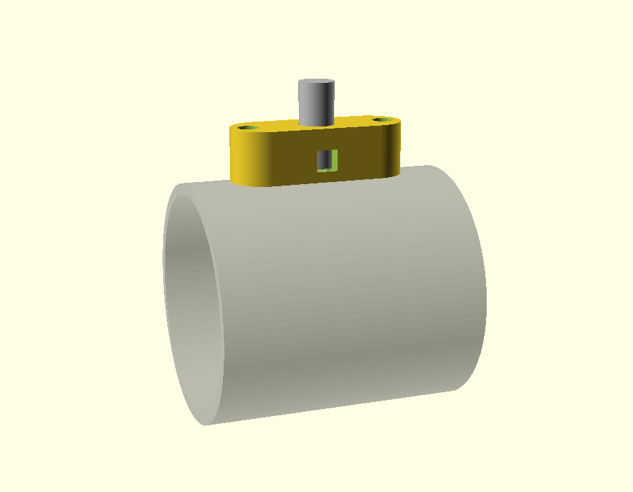
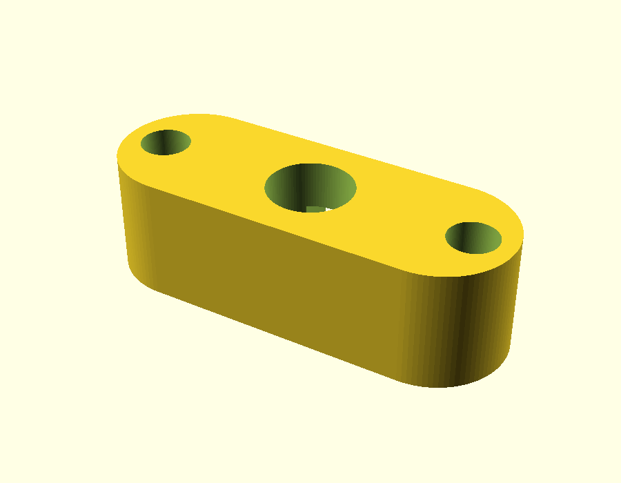
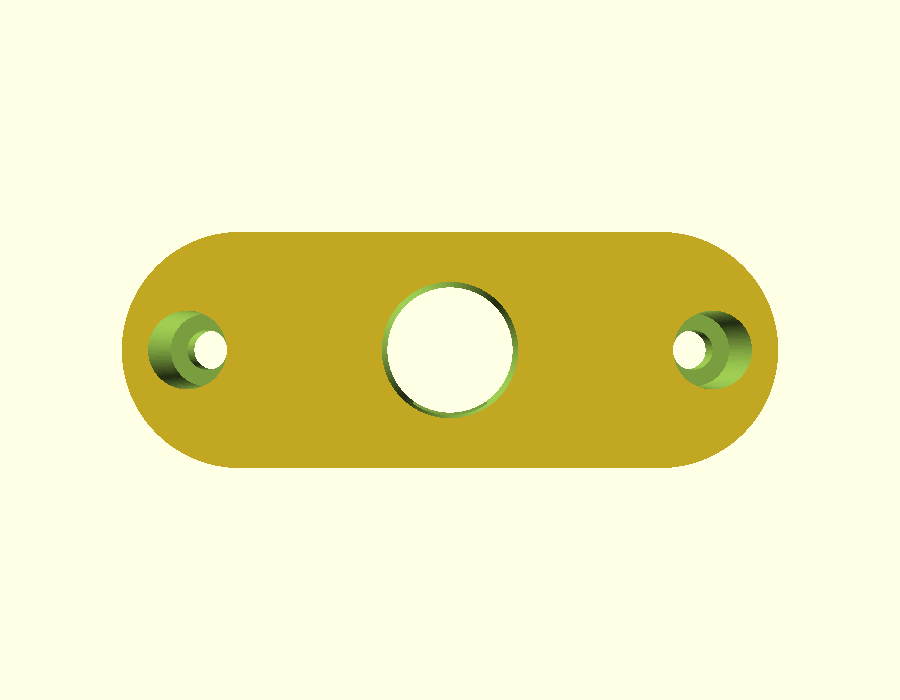

# Thruster mount

A printed pylon that hangs each 62 mm brushless thruster from the **stock motor-post hole**, on a **steel hollow M10 × 1 lamp tube** that also carries the wires. The hull gets no new holes. The part is symmetric, so print two.



| Render | |
|---|---|
|  | Hull face: tube bore in the middle, screw-head pockets at each end |
|  | Looking down through it: the screw clearance holes under the head pockets |

## Status (2026-10-08)

**Version 1, not yet printed.** It is designed from the stock pod's dimensions and the thruster specs; nothing has been measured on the boat yet. Print the two fit tests first.

## How it goes together

```
 inside hull     inner nut + steel washer + rubber washer
 ════════════════╪═══════════════  hull, existing 11 mm hole
                 │  ring of marine sealant on the pylon's top face
             ┌───┴───┐
             │ pylon │  the tube threads into a nut captured in the pylon's base
             └─┬───┬─┘  the wires leave through the side slot
          ╭────┴───┴────╮
          │  thruster   │  2 screws, 40 mm apart, heads inside the pylon
          ╰─────────────╯
```

1. Press an M10 × 1 lamp nut into the hex pocket in the pylon's base.
2. Bolt the pylon to the thruster: two screws down through the head pockets into the thruster's **outer** two holes. The middle hole sits under the tube and stays empty.
3. Thread the tube into the captured nut, flush with the nut's underside. Feed the thruster's three wires in through the side slot and up the tube.
4. Run a ring of marine sealant (e.g. Sikaflex) round the tube on the pylon's top face. Keep it **inside** the head pockets: less than 7 mm from the tube's centre.
5. Push the tube up through the stock hole. Inside the hull, fit a rubber washer, a steel washer and the inner nut, then tighten it so the pylon clamps the hull. **Line the thruster up with the boat's centreline before the sealant sets.** The sealant is also what stops the pylon twisting.
6. Seal the wires where they leave the top of the tube, e.g. with silicone or adhesive-lined heat-shrink.

## Parts per side

| Part | Note |
|---|---|
| Printed pylon | ASA, 4+ walls, 40 %+ infill, thruster face down on the bed (as modelled) |
| M10 × 1 hollow steel lamp tube | Cut to **27 mm** (the `.scad` prints the length for the current settings) |
| 2× M10 × 1 lamp nuts | One captured in the pylon, one inside the hull |
| M10 steel washer + rubber washer | Inside the hull |
| 2× M3 socket-head screws, stainless | **Length to be decided** once the thruster's holes are checked. The pylon gives 4 mm of grip. |
| Marine sealant | Sikaflex or similar |

## Check these before printing the full pylon

Every value marked `VERIFY` in `thruster_mount.scad` is an assumption:

- **The thruster's holes:** three 3 mm holes in a line along the top, 20 mm apart (Cobus, 2026-10-08). The pylon uses the outer pair, 40 mm apart. Still to check: are they threaded? A tapped M3 hole measures about 2.5 mm, so 3 mm may mean plain holes for self-tappers.
- **50 mm of flat hull at each post hole.** The pylon is 50 mm long to reach the outer holes; the stock pod's saddle was only 35 mm.
- **The lamp nut:** 13 mm across the flats and 3 mm thick is assumed. Measure the ones you buy and set `nut_af` and `nut_h`.
- **The hull wall at the post hole:** 3 mm assumed. It only changes the tube length.
- **The duct's outside diameter:** 68 mm assumed (62 mm opening plus about 3 mm walls). With the 15 mm `drop`, the thruster's axis sits about 49 mm below the hull. Check that against how shallow the water is where you launch.
- **Is the hull flat where the pylon sits?** If not, the top face needs to follow the curve.

## Fit tests (a few grams each)

| File | What to check |
|---|---|
| `thruster_mount_fit_bottom.stl` | The two screw holes line up with the thruster's outer holes; the lamp nut presses in and doesn't spin; the tube threads in |
| `thruster_mount_fit_top.stl` | The hull face sits flat against the hull at the post hole |

## Files

- `thruster_mount.scad`: the source. Set `part` to `mount`, `fit_bottom`, `fit_top`, or `all` (an assembly preview, not for printing). Its `assert`s stop a parameter change that would break a wall.
- `thruster_mount_*.stl`: exported from the current settings. Re-export after any change:
  `openscad -D 'part="mount"' -o thruster_mount_mount.stl thruster_mount.scad`
- `renders/`: preview images. OpenSCAD is a snap here and can't write to `/tmp`, so render into the repo.

## Design notes

- **Why a steel tube:** about 1.7 kg of thrust per side bends the post where it meets the hull. A printed 11 mm post would see roughly 7 MPa there, close to where printed layers separate, and the load repeats on every run.
- **Why the outer pair of holes:** the thruster's middle hole is directly under the tube. Using the outer two, 40 mm apart, keeps the tube centred and resists the thrust better than a 20 mm pair.
- **Why sealant, not an O-ring:** the sealant also stops the pylon twisting, and it copes with a hull that isn't perfectly flat. Sealant on the face plus the rubber washer inside the hull do the sealing.
- **Footprint:** 50 × 18 mm, long enough for the outer screw pair, with rounded ends to keep it streamlined.
- **If a pylon still twists:** set `pin_d` (e.g. 3.2) to add a locating pin. That needs one small new hole in the hull.
