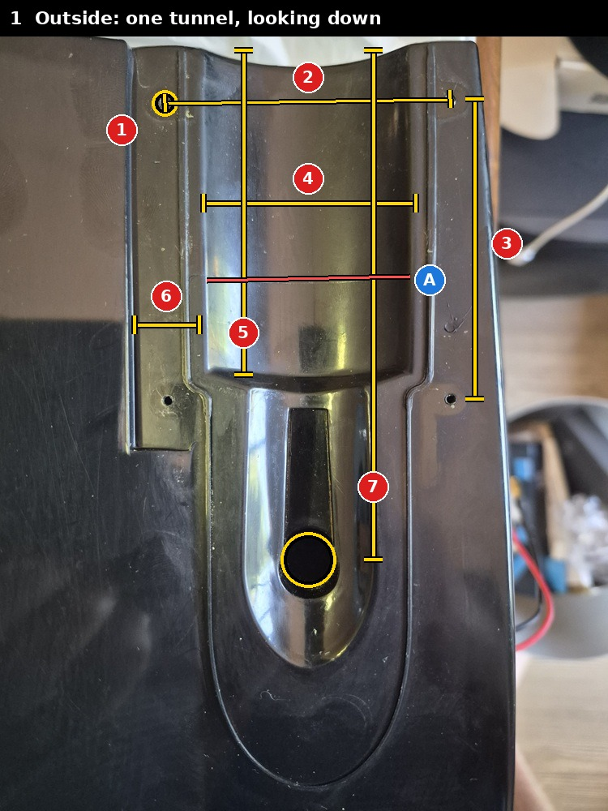
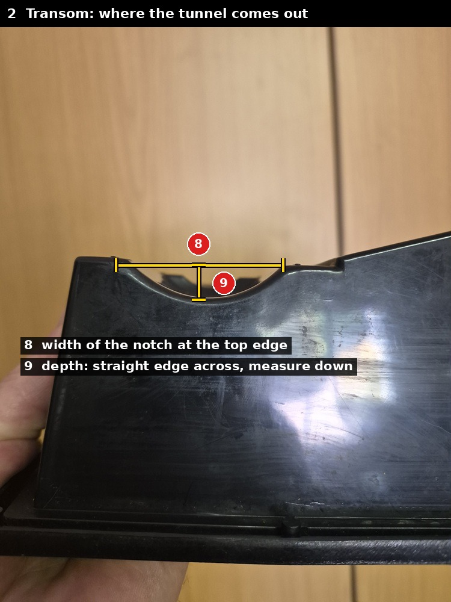
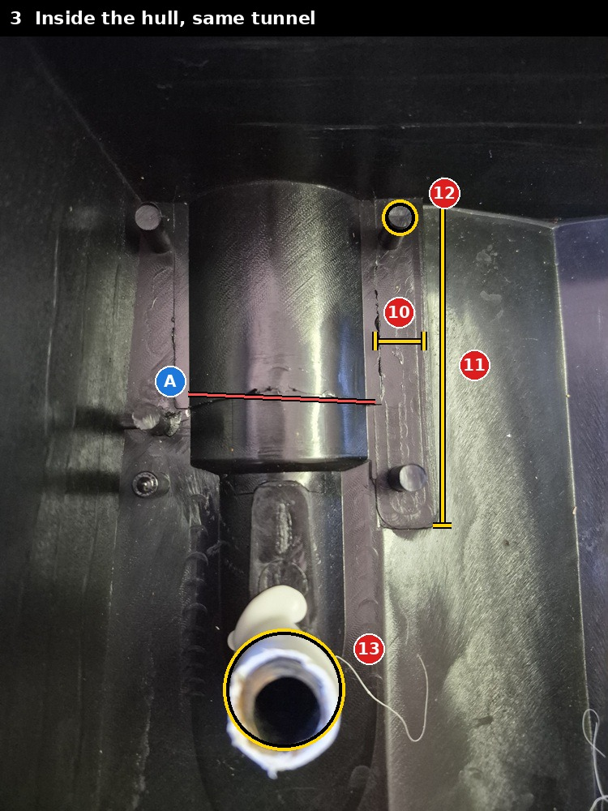
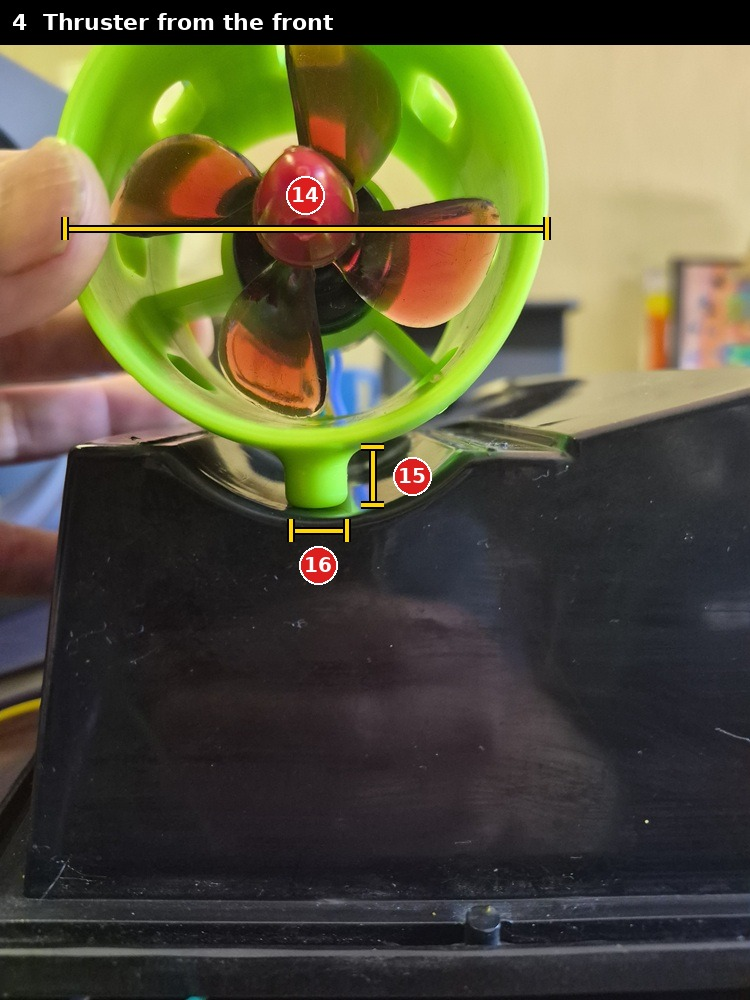
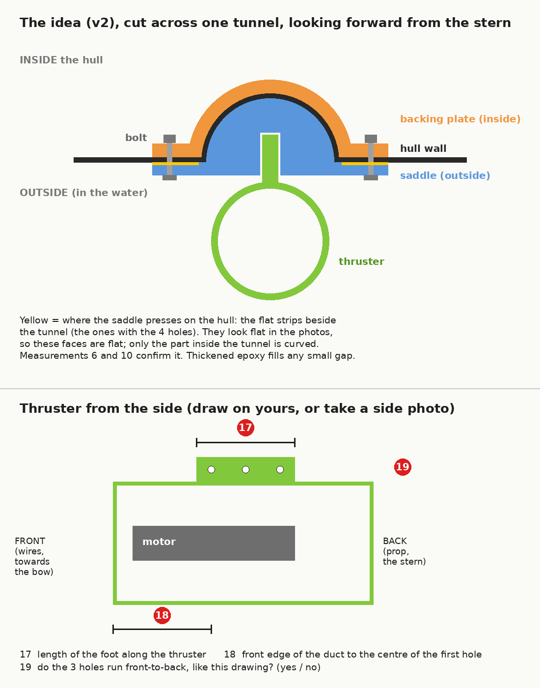

# Measurements for thruster mount v2

Each number on the pictures is one measurement. Fill in the **mm** column (or just send the numbers back in chat), measuring **one side**. If the other side looks different, measure it too.

| Picture | |
|---|---|
| [1 Outside](1_outside_measure.jpg) |  |
| [2 Transom](2_transom_measure.jpg) |  |
| [3 Inside](3_inside_measure.jpg) |  |
| [4 Thruster front](4_thruster_measure.jpg) |  |
| [5 The idea + thruster side](5_idea_and_thruster_side.png) |  |

| # | Picture | What to measure | mm |
|---|---|---|---|
| 1 | 1 | Diameter of one of the 4 small holes | 2 |
| 2 | 1 | Centre to centre, across the tunnel (top-left hole to top-right hole) | 59 |
| 3 | 1 | Centre to centre, along the tunnel (top-right hole to bottom-right hole) | 62 |
| 4 | 1 | Width of the tunnel, edge to edge where it meets the flat strips | 43 |
| 5 | 1 | Length of the tunnel, transom edge to where it steps up | 69 |
| 6 | 1 | Width of one flat strip beside the tunnel. **Is it flat?** Lay a ruler on it | 9 It is flat|
| 7 | 1 | Transom edge to the centre of the wire hole | 111 |
| 8 | 2 | Width of the notch at the top edge of the transom | 43 |
| 9 | 2 | Depth of the notch: lay a straight edge across, measure down to the bottom | 10 |
| 10 | 3 | Width of one flat strip inside, beside the hump | 11 |
| 11 | 3 | Length of that strip | 84 |
| 12 | 3 | One pin: its diameter, and is it **metal or plastic**? | 11.2 plastic |
| 13 | 3 | Hull wall thickness at the wire hole (take the white tube out first) | 3 |
| 14 | 4 | Outside diameter of the duct | 67 on edge and 74 in the middle |
| 15 | 4 | Height of the foot: bottom of the duct to the bottom of the foot | 8,5 on foot edge and 7 in middle of foot |
| 16 | 4 | Width of the foot | 10 |
| 17 | 5 | Length of the foot, front to back | 50 |
| 18 | 5 | Front edge of the duct to the centre of the first of the 3 holes | 14.5 |
| 19 | 5 | Do the 3 holes run front to back? (yes / no) | yes |

| 20 | 7 | Transom edge to the centre of the first two holes | 12 |
| 21 | 6 | Diameter of one post inside | 6.1 - 6.2 |
| 22 | 6 | Height of that post above the flat strip. **Is its top closed (solid)?** | 14.5 it is closed, solid|
| 23 | 6 | The screw beside the post: what size, and what does it hold? | that is actually a post where the one screw goes in. On that image I circled a post that is not used. The blue post is also only on the one side of the hull. The other side does not have this post.|

Follow-up pictures (2026-10-09): [6 posts inside](6_followup_inside.jpg), [7 where the holes start](7_followup_outside.jpg). The v2 idea drawn to scale from 1-19: [8 v2 to scale](8_v2_to_scale.png). Plan view from below: [9 v2 plan](9_v2_plan.png). The two-part saddle (base + sliding carrier), needed because the duct's oval openings are closed: [10 v2 two-part](10_v2_two_part.png).

**Also check A** (the blue A on pictures 1 and 3): is that line across the tunnel a **crack**, or left-over glue? Picture 3 is just some residual plastic probably from the mold is was created from. Picture 1 the blue A is on what looks like a kind of a rail 2mm wide and 0.5mm height that runs accross that pattern

## Files

- `annotate.py` draws the lines on copies of the photos in `../photos/` (pictures 1-4, 6, 7). `sketch.py` draws picture 5; `sketch_v2.py`, `plan_v2.py` and `sketch_v2b.py` draw pictures 8, 9 and 10 to scale from the measurements. Re-run after any change.
